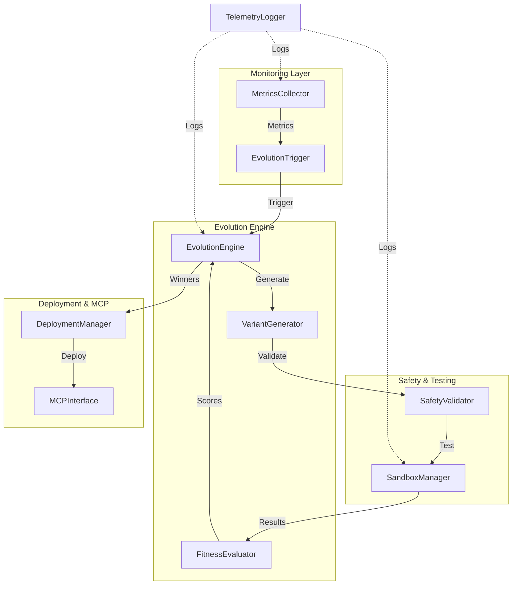
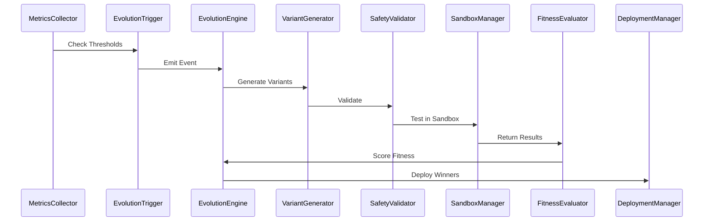
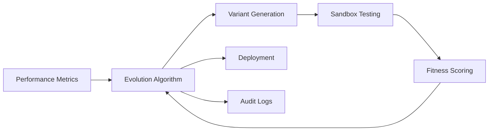
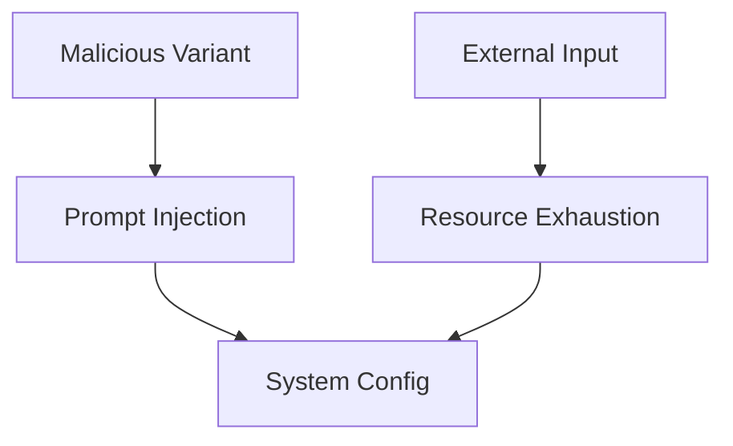

# Goose Evolve: Evolution Architecture

## Table of Contents
1. [Overview](#overview)
2. [System Architecture](#system-architecture)
3. [Core Components](#core-components)
4. [Data Flow](#data-flow)
5. [Extension Points](#extension-points)
6. [Performance Requirements](#performance-requirements)
7. [Security Model](#security-model)

## Overview

Goose Evolve is a self-improvement MCP extension for Goose agents, enabling autonomous evolution via genetic algorithms and sandboxed testing. It focuses on rewriting prompts, MCP configs, and code modules, inspired by Darwin Gödel Machine and AlphaEvolve. The architecture is event-driven for flexibility and fully asynchronous for local deployment.

### Key Design Principles
- **Event-Driven & Async**: Loose coupling via events; all operations are asynchronous to avoid blocking.
- **Modular & Pluggable**: Builds on Goose MCP; easy extensions for custom strategies.
- **Safety-First**: Sandboxing and validation from day one to prevent risks in self-improvement.
- **Local-First**: No cloud dependencies; designed for local deployment with horizontal scaling capabilities.
- **Observability**: Comprehensive logging and telemetry with Langfuse integration.

## System Architecture

### High-Level Component Diagram



### Component Interactions Sequence



## Core Components

### 1. EvolutionEngine
Central orchestrator that manages the evolution process using genetic algorithms, with extensibility for evolutionary strategies and genetic programming.

```python
class EvolutionEngine:
    async def start_evolution_cycle(self, trigger: EvolutionTriggerEvent) -> EvolutionResult:
        pass
    async def evaluate_population(self, population: List[Variant], fitness_fn: FitnessFunction) -> List[Tuple[Variant, float]]:
        pass
    def select_survivors(self, evaluated: List[Tuple[Variant, float]]) -> List[Variant]:
        pass  # Tournament selection implementation
```

### 2. VariantGenerator
Generates agent variants through mutation and crossover operations, with initial focus on prompt evolution.

```python
class VariantGenerator:
    def generate_population(self, base: Agent, size: int) -> List[Variant]:
        pass
    def mutate_prompt(self, prompt: str, type: PromptMutationType) -> str:
        pass
    def crossover(self, p1: Variant, p2: Variant) -> Tuple[Variant, Variant]:
        pass
```

### 3. FitnessEvaluator
Multi-objective scoring system with pluggable fitness functions for flexible evaluation criteria.

```python
class FitnessEvaluator:
    async def evaluate(self, variant: Variant, results: TestResults) -> float:
        pass
    def register_fitness_function(self, name: str, fn: Callable, weight: float):
        pass  # Weighted sum implementation with future Pareto optimization
```

### 4. SafetyValidator
Comprehensive pre-test validation to ensure variant safety before execution.

```python
class SafetyValidator:
    async def validate(self, variant: Variant) -> ValidationResult:
        pass  # Syntax validation, resource limits, malicious code detection
```

## Data Flow

### Evolution Cycle Flow



### Core Events

```yaml
Events:
  EvolutionTriggerEvent:
    data: {trigger_type: str, metrics: Dict}
  TestCompletedEvent:
    data: {variant_id: UUID, results: TestResults}
```

## Extension Points

- **Custom Fitness Functions**: Register custom evaluation criteria through the FitnessEvaluator API.
- **Mutation Operators**: Implement custom mutation strategies for specialized evolution approaches.
- **Evolution Strategies**: Pluggable algorithms including simulated annealing and other optimization methods.
- **MCP Integration**: Abstract interface for seamless Goose agent updates and configuration management.

## Performance Requirements

| Component | Memory Limit | CPU Limit | Latency Target |
|-----------|--------------|-----------|----------------|
| EvolutionEngine | 1 GB | 2 cores | <30s/cycle |
| VariantGenerator | 200 MB | 1 core | <50ms/variant |
| SandboxManager | 2 GB | 4 cores | <2min/test |

- **Scalability**: Designed to handle up to 500 variants with efficient resource management.
- **Benchmarks**: Target processing of 50 variants within 3 minutes for rapid iteration cycles.

## Security Model

### Threat Model



### Security Controls
- **Validation**: Comprehensive input sanitization and resource quotas to prevent malicious variants.
- **Sandboxing**: Isolated Docker environments with strict timeouts and resource limits.
- **Deployment**: User approval mechanisms with automatic rollback capabilities for failed deployments.
- **Audit Trail**: Complete logging of all evolution cycles and security events for monitoring and analysis.

---

This architecture document provides a comprehensive overview of the Goose Evolve system design and implementation approach.