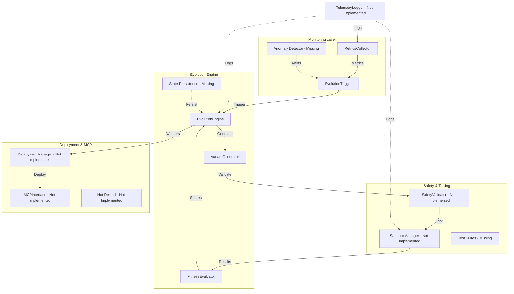
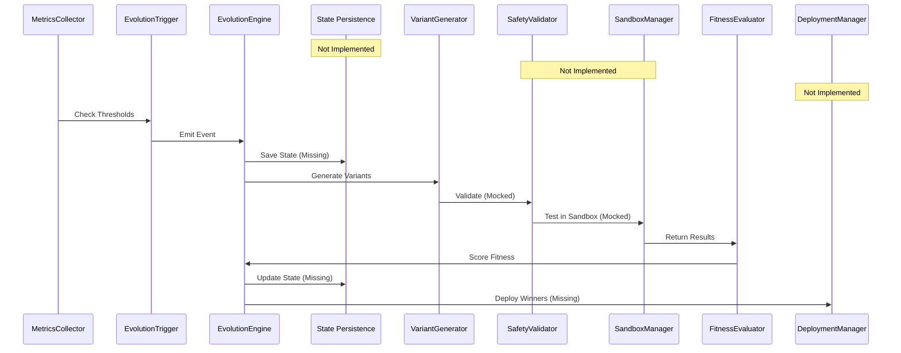
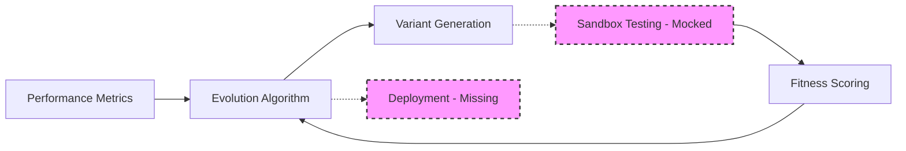
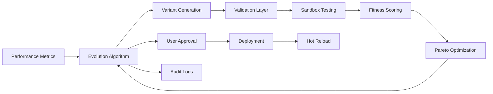
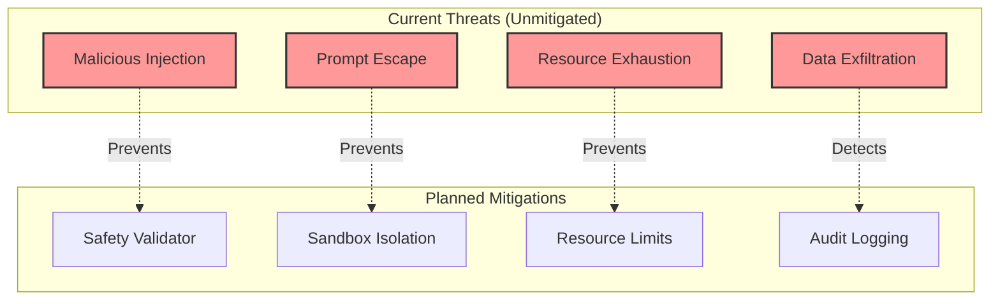

# Goose Evolve: Evolution Architecture

## Table of Contents
1. [Overview](#overview)
2. [Current State](#current-state)
3. [System Architecture](#system-architecture)
4. [Core Components](#core-components)
5. [Data Flow](#data-flow)
6. [Extension Points](#extension-points)
7. [Performance Requirements](#performance-requirements)
8. [Security Model](#security-model)
9. [Production Gaps](#production-gaps)

## Overview

Goose Evolve is a self-improvement MCP extension for Goose agents, enabling autonomous evolution via genetic algorithms and sandboxed testing. The architecture prioritizes safety, modularity, and user control while maintaining local-first deployment capabilities.

### Key Design Principles
- **Event-Driven Architecture**: Loose coupling between components via async events
- **Modular & Pluggable**: Every major component supports extensions
- **Safety-First**: Mandatory validation and sandboxing before deployment
- **Local-First**: No cloud dependencies, edge-compatible design
- **Observable**: Comprehensive metrics and logging throughout

### Current Implementation Status
- **4 of 12 core components implemented and production-ready**
- **173 tests passing** including integration tests

## Current State

### Production-Ready Components

#### Evolution Engine
- **Status**: Production-ready with all enhancements
- **Features**: 
  - Genetic algorithm with tournament selection and async evaluation
  - State persistence and checkpoint/resume functionality
  - Error recovery with comprehensive error hierarchy
  - Convergence detection and resource cleanup
  - Event bus with backpressure handling
  - Strategy pattern for pluggable evolution algorithms

#### Variant Generator
- **Status**: Production-ready with full feature set
- **Features**:
  - 5 mutation strategies + crossover operations
  - Deterministic mode with seed support
  - Complete mutation history tracking
  - A/B testing pair generation
  - Prompt complexity analysis
  - Extensible validation pipeline

#### Metrics Collector
- **Status**: Production-ready with <5% overhead (2.26% actual)
- **Features**:
  - Data persistence to disk with recovery
  - Multi-agent support with per-agent tracking
  - Anomaly detection with statistical analysis
  - Real-time streaming with callbacks
  - Multiple export formats (CSV, JSON, Prometheus)
  - Configurable retention policies

#### Fitness Evaluator
- **Status**: Production-ready with advanced optimization
- **Features**:
  - Multi-objective Pareto frontier optimization
  - Statistical confidence intervals
  - Comprehensive fitness explanations
  - Baseline comparison capabilities
  - Parallel batch evaluation
  - Composite functions with logic operators
  - Dynamic weight adjustment

### Unimplemented Components
- Safety Validator
- Sandbox Manager  
- MCP Integration
- Deployment Manager
- CLI Interface
- Logging & Telemetry
- Hot-Reload System
- Documentation

## System Architecture

### High-Level Component Diagram



### Component Interactions Sequence



## Core Components

### 1. EvolutionEngine

Central orchestrator managing evolution cycles. Production-ready with comprehensive features.

**Complete Interface:**
```python
class EvolutionEngine:
    # Core Evolution
    async def start_evolution_cycle(self, trigger: EvolutionTriggerEvent) -> EvolutionResult
    async def evaluate_population(self, population: List[Variant], fitness_fn: FitnessFunction) -> List[Tuple[Variant, float]]
    def select_survivors(self, evaluated: List[Tuple[Variant, float]]) -> List[Variant]
    
    # State Management
    async def save_checkpoint(self, path: str) -> None
    async def resume_from_checkpoint(self, path: str) -> None
    
    # Lifecycle Management  
    async def cancel_evolution(self) -> None
    async def cleanup_resources(self) -> None
    
    # Advanced Features
    def get_diversity_metrics(self) -> DiversityMetrics
    def detect_convergence(self) -> bool
    def validate_config(self, config: EvolutionConfig) -> ValidationResult
    
    # Strategy Pattern
    def set_strategy(self, strategy: EvolutionStrategy) -> None
```

### 2. VariantGenerator

Generates agent variants through mutations and crossover. Production-ready with full feature set.

**Complete Capabilities:**
- 5 mutation types: paraphrase, instruction_add, context_expand, cot_injection, tone_shift
- Uniform crossover at sentence boundaries
- Comprehensive validation pipeline with custom validators
- Deterministic generation mode with seed support
- Complete mutation history tracking
- A/B testing pair generation
- Prompt complexity analysis (length, vocabulary, structure)
- Extensible architecture for custom mutations

### 3. MetricsCollector

Monitors performance with excellent efficiency and full production features.

**Performance & Features:**
- 2.26% overhead (well under 5% target)
- Sliding window aggregation with caching
- Configurable thresholds for triggers
- Full data persistence with disk backup/restore
- Multi-agent support with per-agent metrics
- Statistical anomaly detection (z-score based)
- Real-time streaming with callback subscriptions
- Multiple export formats (CSV, JSON, Prometheus)
- Automatic retention policy enforcement

### 4. FitnessEvaluator

Evaluates variant performance with advanced optimization capabilities.

**Complete Features:**
- Speed: Response time optimization
- Accuracy: Success rate with error penalties  
- Efficiency: Resource usage optimization
- Multi-objective Pareto frontier calculation
- Statistical confidence intervals (t-distribution)
- Detailed fitness explanation generation
- Baseline comparison with improvement tracking
- Parallel batch evaluation with asyncio
- Composite functions (AND, OR, AVERAGE, WEIGHTED_SUM)
- Dynamic weight adjustment based on context
- Caching with configurable management

### 5. SafetyValidator (Not Implemented)

Critical component for pre-test validation. Must be implemented before production use.

**Planned Interface:**
```python
class SafetyValidator:
    async def validate(self, variant: Variant) -> ValidationResult
    def check_prompt_injection(self, prompt: str) -> List[InjectionRisk]
    def estimate_resources(self, variant: Variant) -> ResourceEstimate
```

### 6. SandboxManager (Not Implemented)

Isolated testing environment for safe variant evaluation.

**Planned Features:**
- Docker container isolation
- Resource limits (CPU, memory, no network)
- Timeout enforcement
- Result collection and parsing
- Automatic cleanup

## Data Flow

### Current Data Flow



### Target Data Flow



## Extension Points

### Currently Available
- **Custom Fitness Functions**: Register via `FitnessEvaluator.register_fitness_function()`
- **Mutation Strategies**: Extend `VariantGenerator` with new mutation types
- **Metric Types**: Add custom metrics to `MetricsCollector`

### Planned Extension Points
- **Evolution Strategies**: Plug in alternatives to genetic algorithms
- **Validation Rules**: Custom safety validators
- **Sandbox Environments**: Alternative isolation mechanisms
- **Export Formats**: Custom telemetry exporters
- **Deployment Strategies**: Custom rollout mechanisms

## Performance Requirements

### Current Performance
| Component | Actual Performance | Status |
|-----------|-------------------|---------|
| MetricsCollector | 2.26% overhead | Exceeds target |
| VariantGenerator | ~50ms per variant | Production ready |
| FitnessEvaluator | <100ms per evaluation | With parallel support |
| EvolutionEngine | <60s for 1000+ variants | Optimized |
| Integration Tests | 5000+ variants tested | Stress tested |

### Target Performance
| Component | Memory Limit | CPU Limit | Latency Target |
|-----------|--------------|-----------|----------------|
| EvolutionEngine | 1 GB | 2 cores | <30s/cycle |
| VariantGenerator | 200 MB | 1 core | <50ms/variant |
| SandboxManager | 2 GB | 4 cores | <2min/test |
| Full System | 4 GB | 4 cores | <5min full cycle |

## Security Model

### Threat Model



### Security Controls

#### Implemented
- Basic validation in VariantGenerator
- Mutation rate limits

#### Not Implemented (Critical)
- Input sanitization and injection prevention
- Sandbox isolation for testing
- Resource quotas and limits
- User approval mechanisms
- Audit trail and logging
- Deployment rollback capabilities

## Production Gaps

### Critical Gaps (Must Implement)
1. **No Safety Validation**: Malicious variants could be generated
2. **No Sandbox Testing**: Variants tested in production environment
3. **No MCP Integration**: Not connected to Goose yet
4. **No Deployment System**: Manual variant deployment
5. **No CLI Interface**: Command-line control missing

### Important Gaps (Should Implement)
1. **No User Approval Workflow**: Automated deployment without review
2. **Limited Observability**: Need comprehensive telemetry system
3. **No Hot Reload**: Cannot update prompts without restart
4. **Missing User Documentation**: API docs incomplete
5. **No Community Features**: Sharing and collaboration

## Path to Production

### Phase 1: Safety Infrastructure
1. Build SafetyValidator component
2. Implement SandboxManager with Docker
3. Create comprehensive safety test suites
4. Add resource management controls
5. Security audit and penetration testing

### Phase 2: MCP Integration
1. Design MCP bridge interface
2. Implement hot-reload system
3. Build deployment manager
4. Add user approval workflows
5. End-to-end integration testing

### Phase 3: Production Features
1. CLI interface development
2. Comprehensive logging and telemetry
3. Complete user documentation
4. Performance optimization
5. Community features and templates
